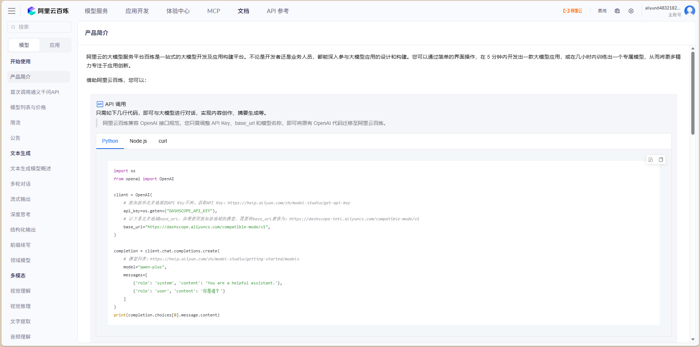
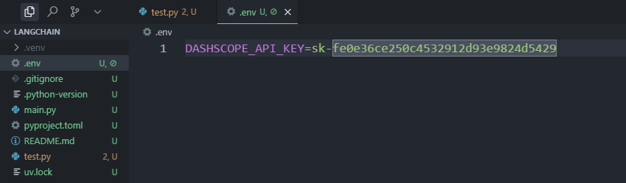
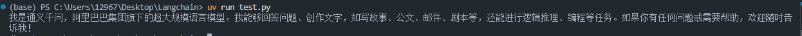
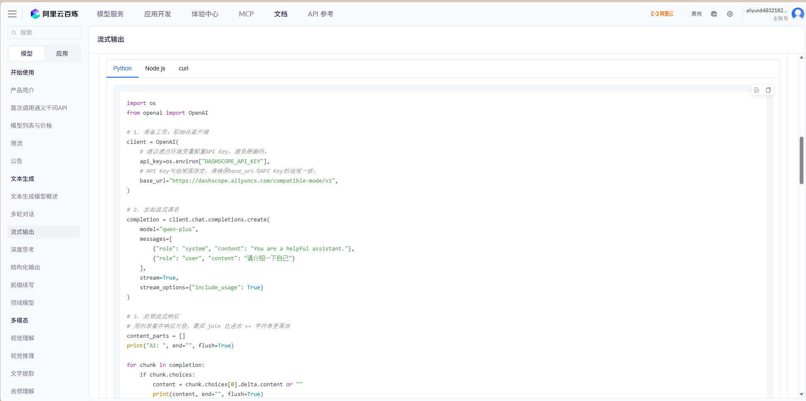
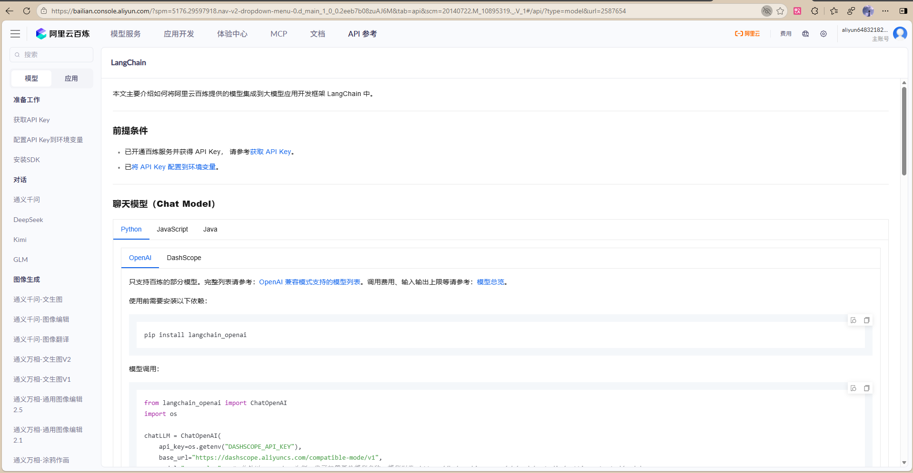

# 前言：为什么选择 LangChain？

我们先完成一次与 LLM 的问答来体验一下。以阿里的通义千问为例，目前市面上大多数模型都支持 OpenAI 的调用规范，这让我们的学习成本大大降低。

### 准备工作

在开始之前，我们需要先申请 LLM 调用的 API Key。访问阿里云百炼平台，注册并获取你的 API Key：



然后使用 `uv` 创建项目（uv 是一个现代化的 Python 包管理工具，速度快且易用）：

```bash
uv init
```

安装相关依赖的库：

```bash
uv add openai
uv add python-dotenv
```

创建 `.env` 环境变量文件，写入你的 API Key，这样可以避免在代码中硬编码敏感信息：

```
DASHSCOPE_API_KEY=你的API密钥
```



### 第一次对话

现在，让我们使用标准的 OpenAI SDK 来完成第一次与 AI 的对话：

```python
import os
from openai import OpenAI
from dotenv import load_dotenv

load_dotenv() #用于加载.env 里面的所有环境变量

client = OpenAI( # 新加坡和北京地域的 API Key 不同。获取 API Key：https://help.aliyun.com/zh/model-studio/get-api-key
api_key=os.getenv("DASHSCOPE_API_KEY"), # 以下是北京地域 base_url，如果使用新加坡地域的模型，需要将 base_url 替换为：https://dashscope-intl.aliyuncs.com/compatible-mode/v1
base_url="https://dashscope.aliyuncs.com/compatible-mode/v1",
)

completion = client.chat.completions.create( # 模型列表：https://help.aliyun.com/zh/model-studio/getting-started/models
model="qwen-plus",
messages=[
{'role': 'system', 'content': 'You are a helpful assistant.'},
{'role': 'user', 'content': '你是谁？'}
]
)
print(completion.choices[0].message.content)
```

运行代码后，模型会给出回答。但你会发现，回答是全部一次性输出的：



当输出内容较多时，用户需要等待所有内容生成完毕才能看到结果，体验感并不好。这时候，我们就需要启用**流式输出**，让回答像打字机一样逐字显示。

### 优化：启用流式输出

在阿里云百炼的官方文档中，我们可以找到流式输出的示例代码：


```python
import os
from openai import OpenAI
from dotenv import load_dotenv
load_dotenv()

# 1. 准备工作：初始化客户端

client = OpenAI( # 建议通过环境变量配置 API Key，避免硬编码。
api_key=os.environ["DASHSCOPE_API_KEY"], # API Key 与地域强绑定，请确保 base_url 与 API Key 的地域一致。
base_url="https://dashscope.aliyuncs.com/compatible-mode/v1",
)

# 2. 发起流式请求

completion = client.chat.completions.create(
model="qwen-plus",
messages=[
{"role": "system", "content": "You are a helpful assistant."},
{"role": "user", "content": "请介绍一下自己"}
],
stream=True,
stream_options={"include_usage": True}
)

# 3. 处理流式响应

# 用列表暂存响应片段，最后 join 比逐次 += 字符串更高效

content_parts = []
print("AI: ", end="", flush=True)

for chunk in completion:
if chunk.choices:
content = chunk.choices[0].delta.content or ""
print(content, end="", flush=True)
content_parts.append(content)
elif chunk.usage:
print("\n--- 请求用量 ---")
print(f"输入 Tokens: {chunk.usage.prompt_tokens}")
print(f"输出 Tokens: {chunk.usage.completion_tokens}")
print(f"总计 Tokens: {chunk.usage.total_tokens}")

full_response = "".join(content_parts)

# print(f"\n--- 完整回复 ---\n{full_response}")
```

这样就可以看到模型像打字机一样输出回答内容

### 使用 LangChain 实现同样功能

那么如果我们使用 LangChain 框架与 AI 进行对话会怎样呢？

首先，安装 LangChain 依赖：

```bash
uv add langchain_openai
```



因为 LangChain 是开源的，所以生态很完善，比如阿里的模型就原生支持 LangChain 调用。

#### 基础对话

```python
from langchain_openai import ChatOpenAI
import os
from dotenv import load_dotenv

load_dotenv()

chatLLM = ChatOpenAI(
    api_key=os.getenv("DASHSCOPE_API_KEY"),
    base_url="https://dashscope.aliyuncs.com/compatible-mode/v1",
    model="qwen-plus",  # 此处以 qwen-plus 为例，您可按需更换模型名称
)

messages = [
    {"role": "system", "content": "You are a helpful assistant."},
    {"role": "user", "content": "你是谁？"}
]

response = chatLLM.invoke(messages)
print(response.content)
```

#### 流式输出

```python
from langchain_openai import ChatOpenAI
import os
from dotenv import load_dotenv

load_dotenv()

chatLLM = ChatOpenAI(
    api_key=os.getenv("DASHSCOPE_API_KEY"),
    base_url="https://dashscope.aliyuncs.com/compatible-mode/v1",
    model="qwen-plus",
)

messages = [
    {"role": "system", "content": "You are a helpful assistant."},
    {"role": "user", "content": "你是谁？"}
]

# 使用 stream() 方法实现流式输出
for chunk in chatLLM.stream(messages):
    print(chunk.content, end="", flush=True)
```

### LangChain 的优势与劣势

#### 代码对比

我们和之前的代码对比一下，不难发现，使用 LangChain 框架后代码量减小了，结构更加清晰，这不就是提升了我们开发的便捷性和开发效率吗。

刚刚我们便捷地体验到使用 LangChain 来进行大模型应用开发的快速便捷，其实 LangChain 还有其他的优点：

#### 主要优势

1. **组件丰富**  
   如联网搜索、向量数据库、Embedding、文本分块等等，经过 LangChain 的封装后可以很便捷地使用。

2. **高效的性能优化**  
   LangChain 在性能优化方面表现出色。其内置的缓存机制和异步处理能力，能够有效减少系统响应时间，提升用户体验。对于高并发的应用场景，LangChain 的优化策略尤为关键。

3. **模块化设计和强大的扩展性**  
   开发者可以根据需求灵活选择或替换功能模块和扩展，包括插件机制、API 接口和自定义模块。这种扩展性使得它能够适应各种复杂的应用场景，从简单的文本生成到复杂的对话系统，都能找到合适的解决方案。

4. **开源社区支持**  
   我觉得这也是最重要的一点，LangChain 拥有一个活跃的开发者社区和丰富的第三方库支持。这为开发者提供了大量的资源和技术支持，降低了开发门槛，同时也促进了技术的快速迭代和创新。

#### 需要注意的地方

当然，LangChain 也有一些不足之处。作为 2022 年创建的框架，每个版本的迭代都会更换很多东西，导致使用 LangChain 0.2 版本开发的项目，在需要更新到 LangChain 0.3 以获得更多功能时，需要更改迁移的代码较多。这是快速发展中的框架常见的问题。

---